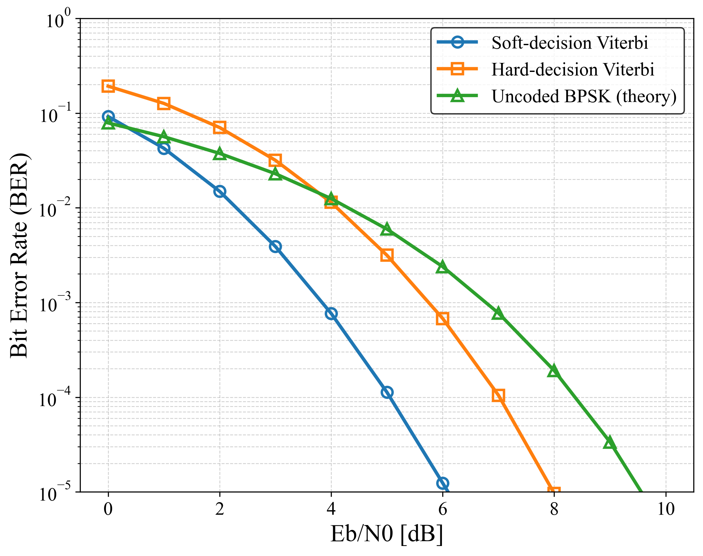

# fec-nsc-codec


C implementation of **Non-Systematic Convolutional Codes (NSC)** with **Viterbi decoding**
for Forward Error Correction (FEC).
Supports **hard-decision** and **soft-decision (LLR)** decoding.

---

## 📘 Overview

This repository provides a lightweight and modular implementation of
**Non-Systematic Convolutional (NSC) Codes**, including:

- Rate-1/2 convolutional encoder
- 4-state trellis (constraint length 3)
- Hard/soft Viterbi decoder
- Branchless trellis-based implementation
- BER simulation under AWGN

Designed for:

- FEC research
- Wireless communication (5G/6G)
- Embedded systems
- Error-control coding education

---

## 📦 Version Information

Current version: **0.1.0**
(Automatically synchronized with Git tags)

To see the program version:

```sh
./test_nsc
```

Output example:

```
fec-nsc-codec version 0.1.0
```

---

## 📁 Project Structure

```
fec-nsc-codec
├── src/                 # Encoder/decoder implementation
├── include/             # Header files
├── examples/            # Test & BER simulation
├── Makefile             # Build script
└── .github/workflows    # CI pipeline
```

---

## 📑 Features

### ✔ NSC Encoder (Rate 1/2)
- Trellis table–based generation
- Forced termination (tail bits)
- Branchless implementation

### ✔ Viterbi Decoder
- Hard-decision Viterbi (Hamming metric)
- Soft-decision Viterbi (LLR metric)
- Full traceback implementation
- Trellis defined in `trellis.h`

### ✔ AWGN BER Simulation
The program `examples/test_nsc.c` evaluates BER vs Eb/N0
for both hard- and soft-decision decoding.

---

## 🛠 Build Instructions

### Requirements
- GCC or Clang
- `make`
- Linux / macOS / WSL / MinGW

---

### Build

```sh
make
```

Generated binary:

```
test_nsc   # BER simulation program
```

Clean build:

```sh
make clean
```

---

## 🚀 Usage Example

Run BER simulation:

```sh
./test_nsc
```

Example BER result (CSV):

```
results/ber_result.csv
```

---

## 📉 BER Performance

Example BER curve for rate-1/2 NSC
(4-state Viterbi, AWGN, BPSK):



---

## 📂 Source Code Structure

### src/
| File | Description |
|------|-------------|
| `nsc_encoder.c` | NSC encoder implementation |
| `nsc_decoder.c` | Hard & soft Viterbi decoder |
| `trellis.c` | Next-state & output tables |

### include/
| File | Description |
|------|-------------|
| `nsc_encoder.h` | Encoder API |
| `nsc_decoder.h` | Decoder API |
| `trellis.h` | Trellis constants |

### examples/
| File | Description |
|------|-------------|
| `test_nsc.c` | BER simulation under AWGN |

---

## 📜 License

This project is licensed under the **MIT License**.
You may use it for research, education, and commercial applications.

---

## 🤝 Contributing

Pull requests are welcome.
For major changes, please open an issue first.

---

## ⭐ Acknowledgements

Developed as part of research in
**Forward Error Correction (FEC)** and **physical-layer communications**.

If this repository is useful, please consider giving it a ⭐ on GitHub!
